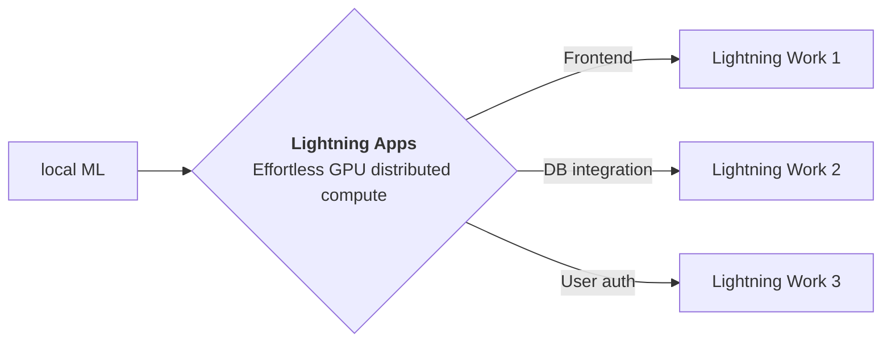

<div style="height: 90pt;"></div>
<div style="flex: 0 0 16%; margin-top: -10pt;">

</div>
<div style="flex: 0 0 65%; text-align: center;">
<h1 style="margin-bottom: 10pt;">BLIP: Research Poster</h1>
<h2>Bootstrapping Language-Image Pre-training for Unified Vision-Language Understanding and Generation</h2>
</div>
<div style="flex: 1">
    <div style="display: flex; align-items: center;">
        
        <div style="font-size: 0.9rem; margin-right: 5pt;"><a href="https://github.com/salesforce/">salesforce</a></div>
    </div>
    <div style="display: flex; align-items: center;">
        
        <div style="font-size: 0.9rem;"><a href="https://twitter.com/salesforce">@salesforce</a></div>
    </div>
</div>

--split--

# Unified Vision-Language Understanding and Generation

This app is a demo
of [BLIP](https://github.com/salesforce/BLIP) released by salesforce

Explore the tabs at the top of this app to view blog, paper, and model demo.


Vision-Language Pre-training (VLP) has advanced the performance for many vision-language tasks. However, most existing pre-trained models only excel in either understanding-based tasks or generation-based tasks. Furthermore, performance improvement has been largely achieved by scaling up the dataset with noisy image-text pairs collected from the web, which is a suboptimal source of supervision. In this paper, the authors propose BLIP, a new VLP framework which transfers flexibly to both vision-language understanding and generation tasks. BLIP effectively utilizes the noisy web data by bootstrapping the captions, where a captioner generates synthetic captions and a filter removes the noisy ones. We achieve state-of-the-art results on a wide range of vision-language tasks, such as image-text retrieval (+2.7% in average recall@1), image captioning (+2.8% in CIDEr), and VQA (+1.6% in VQA score). BLIP also demonstrates strong generalization ability when directly transferred to video-language tasks in a zero-shot manner.

--split--

# Lightning Apps

## Lightning Apps can be built for any AI use case, including AI research, fault-tolerant production-ready pipelines, and everything in between.

!!! abstract "Key Features"

```
- **Easy to use-** Lightning apps follow the Lightning philosophy- easy to read, modular, intuitive, pythonic and highly composable interface that allows you to focus on what's important for you, and automate the rest.
- **Easy to scale**- Lightning provides a common experience locally and in the cloud. The Lightning.ai cloud platform abstracts the infrastructure, so you can run your apps at any scale. The modular and composable framework allows for simpler testing and debugging.
- **Leverage the power of the community-** Lightning.ai offers a variety of apps for any use case you can use as is or build upon. By following the best MLOps practices provided through the apps and documentation you can deploy state-of-the-art ML applications in days, not months.
```



### Available at : `Lightning-AI/lightning-template-research-app/app.py`

```python
import lightning as L

poster_dir = "resources"
paper = "https://arxiv.org/pdf/2201.12086.pdf"
blog = "https://blog.salesforceairesearch.com/blip-bootstrapping-language-image-pretraining/"
github = "https://github.com/salesforce/BLIP"
tabs = ["Poster", "Blog", "Model Demo", "Notebook Viewer", "Paper"]

app = L.LightningApp(
    ResearchApp(
        poster_dir=poster_dir,
        paper=paper,
        blog=blog,
        notebook_path="BLIP/demo.ipynb",
        launch_gradio=True,
        tab_order=tabs,
        launch_jupyter_lab=False,  # don't launch for public app, can expose to security vulnerability
    )
)
```

### Citation

```bibtex

@article{YourName,
  title={Your Title},
  author={Your team},
  journal={Location},
  year={Year}
}

```
